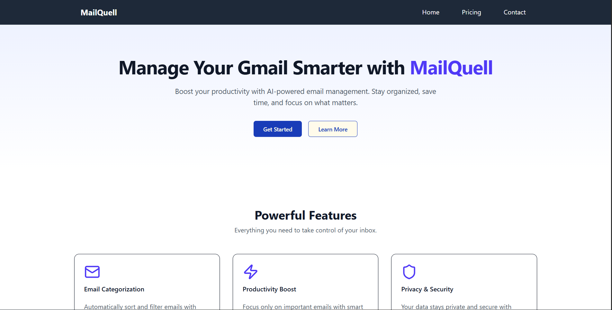
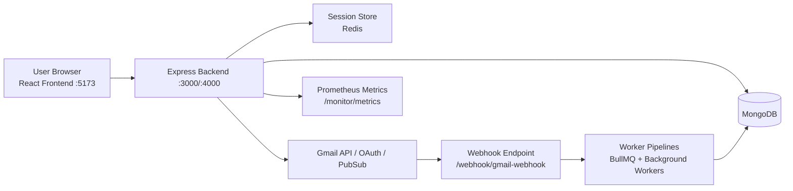

# MailSift (MailQuell)

<p align="center">
	<strong>Production-grade Gmail automation and inbox intelligence platform</strong>
</p>

<p align="center">
	
	
	
	
	
</p>

MailSift connects to Gmail via OAuth 2.0, lets users define pattern-driven tags, watches inbox events in near real time, processes matched messages with background workers, and serves analytics in a React dashboard.

---

## Contents

- [Demo](#demo)
- [Highlights](#highlights)
- [Quick Start](#quick-start)
- [Architecture](#architecture)
- [Repository Layout](#repository-layout)
- [Tech Stack](#tech-stack)
- [Environment Variables](#environment-variables)
- [Docker Deployment](#docker-deployment)
- [API Surface](#api-surface)
- [Observability](#observability)
- [Testing and Code Quality](#testing-and-code-quality)
- [CI/CD](#cicd)
- [Production Checklist](#production-checklist)
- [Security](#security)
- [Troubleshooting](#troubleshooting)
- [Roadmap](#roadmap)

---

## Demo

### Product Screenshot



### Product Video

```html
<video controls width="900" src="docs/demo/mailquell-demo.mp4">
  Your browser does not support the video tag.
</video>
```

Tip: Place your demo video file at `docs/demo/mailquell-demo.mp4`.

---

## Highlights

- Google OAuth 2.0 authentication with session-based login flow
- Gmail watch lifecycle APIs: start, status, stop
- Redis + worker queues for asynchronous mail processing
- Tag pages and custom pattern matching pipeline
- Processed-mail stats and recent activity feed endpoints
- MongoDB persistence for users, tags, pages, and processed email data
- Prometheus metrics endpoint with request-latency histogram
- Containerized full stack with backend, frontend, Redis, Prometheus, ngrok

---

## Quick Start

### Prerequisites

- Node.js 22+
- npm 10+
- Docker Desktop
- MongoDB instance
- Redis instance
- Google Cloud project with Gmail API and Pub/Sub

### 1) Install dependencies

```bash
cd Backend
npm install

cd ../frontend
npm install
```

### 2) Configure environment

- Create `Backend/.env` (see full template in Environment Variables)
- Create `frontend/.env` with:

```env
VITE_BACKEND_URL=http://localhost:3000
```

### 3) Run backend

```bash
cd Backend
npm run start
```

### 4) Run frontend

```bash
cd frontend
npm run dev
```

### 5) Access app

- Frontend: `http://localhost:5173`
- Backend: `http://localhost:3000`

---

## Architecture



---

## Repository Layout

```text
MailSift/
	Backend/                 Node.js + Express API, routes, workers, validations
	frontend/                React + Vite dashboard
	docker-compose.yml       Local/prod-like multi-service orchestration
	.github/workflows/       CI/CD pipeline definitions
```

### Backend modules

- `routes/`: API route handlers
- `workers/`: asynchronous background workers
- `queues/`: queue definitions and orchestration
- `webhooks/handlers/`: Gmail webhook handling
- `metrics/`: Prometheus instrumentation
- `validations/`: request validation schemas

---

## Tech Stack

| Layer               | Technologies                                 |
| ------------------- | -------------------------------------------- |
| Backend             | Node.js 22, Express 4                        |
| Frontend            | React 19, Vite 7, Tailwind CSS 4             |
| Data                | MongoDB                                      |
| Cache/Queues        | Redis, BullMQ                                |
| Auth                | Google OAuth 2.0                             |
| Observability       | Prometheus, prom-client                      |
| Security Middleware | Helmet, xss-clean, express-mongo-sanitize    |
| Delivery            | Docker, Docker Compose, GitHub Actions, GHCR |

---

## Environment Variables

Create `Backend/.env`:

```env
# Runtime
NODE_ENV=development
PORT=3000
FRONTEND_URL=http://localhost:5173

# Security / sessions
SESSION_SECRET=replace-with-long-random-secret
ENCRYPTED_KEY=replace-with-32-char-min-secret

# Data stores
MONGODB_URL=mongodb://127.0.0.1:27017/mailquell
REDIS_URL=redis://127.0.0.1:6379

# Google OAuth / Gmail
GMAIL_CLIENT_ID=your-client-id
GMAIL_CLIENT_SECRET=your-client-secret
GMAIL_REDIRECT_URI=http://localhost:3000/users/auth/google/callback
GMAIL_PROJECT_ID=your-gcp-project-id
GMAIL_AUTH_URI=https://accounts.google.com/o/oauth2/auth
GMAIL_TOKEN_URI=https://oauth2.googleapis.com/token
GMAIL_AUTH_PROVIDER_X509_CERT_URL=https://www.googleapis.com/oauth2/v1/certs
TOPIC_NAME=your-pubsub-topic-name

# Optional ngrok
NGROK_AUTH_TOKEN=your-ngrok-token
NGROK_DOMAIN=your-ngrok-domain
```

Create `frontend/.env`:

```env
VITE_BACKEND_URL=http://localhost:3000
```

---

## Docker Deployment

From repo root:

```bash
docker compose up -d --build
```

### Services

| Service            | Port | Purpose                  |
| ------------------ | ---- | ------------------------ |
| mailquell-backend  | 3000 | API, auth, workers       |
| mailquell-frontend | 5173 | UI app                   |
| mailquell-redis    | 6379 | Session + queue broker   |
| prom-server        | 9090 | Metrics scraping         |
| mailquell-ngrok    | 4040 | Public tunnel (optional) |

Stop stack:

```bash
docker compose down --remove-orphans
```

---

## API Surface

Base URL: `http://localhost:3000`

### Authentication routes

| Method | Route                       | Description                          |
| ------ | --------------------------- | ------------------------------------ |
| GET    | /users/auth                 | Initiate Google OAuth                |
| GET    | /users/auth/google/callback | OAuth callback and frontend redirect |

### User/watch routes

| Method | Route        | Description                     |
| ------ | ------------ | ------------------------------- |
| POST   | /watch-gmail | Start Gmail watch               |
| POST   | /stop-watch  | Stop Gmail watch                |
| GET    | /status      | Fetch watch status              |
| POST   | /auto-login  | Auto login from session/cookies |
| POST   | /log-out     | Logout and destroy session      |

### Processed mail routes

| Method | Route                           | Description        |
| ------ | ------------------------------- | ------------------ |
| GET    | /processed/processed-mail-stats | Stats by createdBy |
| GET    | /processed/mail-activity        | Activity timeline  |

### Tags and pages routes

| Method | Route                        | Description         |
| ------ | ---------------------------- | ------------------- |
| GET    | /api/tag-inputs              | List tag inputs     |
| POST   | /api/create-tag-inputs       | Create tag input    |
| DELETE | /api/remove-tag-inputs/:id   | Remove tag input    |
| DELETE | /api/clearall-tag-inputs/:id | Clear tag input set |
| GET    | /api/tag-pages               | List tag pages      |
| POST   | /api/create-tag-page         | Create tag page     |
| PATCH  | /api/update-tag-page/:id     | Update tag page     |
| DELETE | /api/remove-tag-page/:id     | Delete tag page     |

### Profile, policy, and webhook routes

| Method | Route                  | Description        |
| ------ | ---------------------- | ------------------ |
| GET    | /details/profile       | Fetch profile data |
| GET    | /terms.html            | Terms endpoint     |
| GET    | /privacy.html          | Privacy endpoint   |
| POST   | /webhook/gmail-webhook | Gmail push webhook |

---

## Observability

- Metrics endpoint: `GET /monitor/metrics`
- Request latency histogram: `http_request_duration_ms`
- Default process/runtime metrics collected by prom-client
- Prometheus scrape config stored in `Backend/prometheus-config.yml`

---

## Testing and Code Quality

### Backend

```bash
cd Backend
npm run lint
npm run test
```

### Frontend

```bash
cd frontend
npm run lint
npm run build
```

---

## CI/CD

Workflow file: `.github/workflows/main.yml`

Pipeline stages:

1. Backend CI (install, lint, tests with Mongo + Redis)
2. Frontend CI (install, lint, build)
3. Security scan (Trivy + SARIF upload)
4. Docker image build and push to GHCR
5. Deploy simulation using Docker Compose

---

## Production Checklist

- Use managed MongoDB and Redis with backups/replication
- Rotate OAuth, session, and encryption secrets periodically
- Enforce HTTPS and secure cookies in production
- Restrict CORS origins to trusted frontend domains
- Add reverse proxy or load balancer
- Configure centralized logs and alerting
- Track SLOs for latency, errors, queue lag, webhook health
- Add indexes for hot query paths (for example, createdBy, processAt)
- Tune worker concurrency and autoscaling behavior

---

## Security

- Never commit environment secrets
- Keep SESSION_SECRET long, random, and environment-specific
- Minimize OAuth scopes where possible
- Validate/sanitize all request input consistently
- Review session and token persistence behavior before launch

---

## Troubleshooting

### OAuth redirect mismatch

- Ensure GMAIL_REDIRECT_URI matches Google Console exactly.

### Session or cookie not persisting

- Verify frontend/backend origin settings and credentials mode.
- In production, ensure HTTPS for secure cookies.

### Redis connection issues

- Validate REDIS_URL and network reachability.

### MongoDB connection issues

- Validate MONGODB_URL and DB availability.

### Frontend API connectivity issues

- Validate frontend VITE_BACKEND_URL and backend exposed port.

---

## Roadmap

- Add OpenAPI/Swagger API docs
- Increase frontend/worker test coverage with coverage gates
- Add dedicated health and readiness endpoints
- Add rate limiting for auth and webhook endpoints
- Add feature flags and strict config validation
